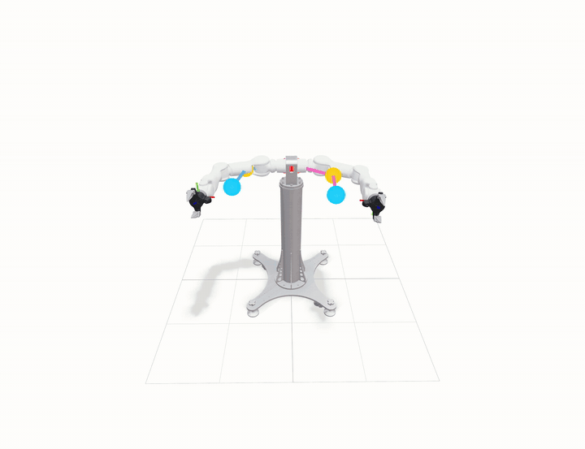

# SEW-Mimic Retargeting

[](https://github.com/chase6305/SEW-mimic-retargeting/actions/workflows/ci.yml)

A Python/NumPy implementation of the closed-form geometric retargeting method
from *A Closed-Form Geometric Retargeting Solver for Upper Body Humanoid Robot
Teleoperation*. The repository includes the Marvin M6 robot assets, single- and
dual-arm retargeting, interactive viser demos, and the paper's capsule/XPBD
bimanual self-collision safety-filter pipeline.



## Highlights

- Closed-form seven-DoF arm retargeting without iterative numerical IK.
- IK-Geo Subproblems 1, 2, and 4.
- Parallel-wrist `AlignWrist` and joint-limit-aware analytical solution selection.
- Marvin M6 left/right arm extraction from the bundled URDF.
- Continuous 60-second dual-arm human-like motion demo.
- Viser visualization of robot meshes, keypoints, bones, and coordinate frames.
- Capsule parameters estimated from collision-mesh oriented bounding boxes.
- Continuous-path collision sampling and XPBD bimanual safety filtering.
- Final FK validation before a corrected command is accepted.
- Stage logging and clearly defined solve-rate/latency metrics.
- Unit, integration, formatting, linting, wheel-build, and asset-packaging checks.

SEW-Mimic matches limb directions and hand orientation rather than absolute
human limb lengths:

```text
upper-arm direction = normalize(elbow - shoulder)
forearm direction   = normalize(wrist - elbow)
end-effector target = hand_orientation
```

## Installation

Python 3.10 or newer is required.

Core solver only:

```bash
pip install -e .
```

Viser demos:

```bash
pip install -e '.[visualization]'
```

OOBB capsule fitting and safety-filter configuration:

```bash
pip install -e '.[safety]'
```

Complete development environment:

```bash
pip install -e '.[dev,visualization,safety]'
```

The Marvin URDF, collision meshes, and visual meshes are included in built
wheels as data files. An alternative URDF can be supplied to every Marvin API
and demo with an explicit path.

## Quick start

### Solve one arm frame

```python
import numpy as np

from sew_mimic import sew_mimic
from sew_mimic.robots import load_marvin_arm

arm = load_marvin_arm(side="left")

q_current = np.zeros(7)                 # radians
shoulder = np.array([0.0, 0.0, 0.0])   # metres, left_arm_base frame
elbow = np.array([0.20, 0.20, 0.05])
wrist = np.array([0.45, 0.25, 0.10])
hand_orientation = np.eye(3)            # valid SO(3) rotation matrix

q_command = sew_mimic(
    arm.robot,
    q_current,
    shoulder,
    elbow,
    wrist,
    hand_orientation,
)
```

The returned Marvin joint order is:

```text
SHOULDER_PITCH
SHOULDER_ROLL
ELBOW_PITCH
ELBOW_YAW
WRIST_PITCH
WRIST_YAW
WRIST_ROLL
```

### Filter one bimanual command

```python
import numpy as np

from sew_mimic.robots import MarvinSafetyFilter

safety_filter = MarvinSafetyFilter(padding=1.05)

result = safety_filter.filter(
    q_left_current=np.zeros(7),
    q_right_current=np.zeros(7),
    q_left_desired=q_left_target,
    q_right_desired=q_right_target,
)

q_left_command = result.q_left
q_right_command = result.q_right

print(result.safe)
print(result.status.value)
print(result.minimum_distance)  # metres; negative means capsule penetration
print(result.iterations)
```

`MarvinSafetyFilter(...)` is also callable directly and delegates to `filter()`.

Safety-filter statuses:

| Status | Meaning |
|---|---|
| `accepted` | The desired command was already collision-free. |
| `corrected` | XPBD generated a corrected command that passed final FK validation. |
| `xpbd_failed` | XPBD did not achieve the configured safety distance. |
| `ik_failed` | Corrected keypoints had no valid joint-limit-aware SEW solution. |
| `validation_failed` | The reconstructed joint pose remained unsafe. |

For every failure status, the filter returns the current pose rather than the
unsafe desired pose.

## Input conventions

- `q_current`, `q_command`, and joint limits use radians.
- Left-arm inputs use `left_arm_base`; right-arm inputs use `right_arm_base`.
- Shoulder, elbow, wrist, and hand orientation must share one frame.
- Positions conventionally use metres, although limb length does not affect the
  direction-only SEW objective.
- Shoulder-to-elbow and elbow-to-wrist vectors must not be near zero.
- `hand_orientation` must be a finite 3-by-3 SO(3) matrix.

To convert world-frame human inputs into an arm-base frame:

```python
R_arm_world = R_world_arm.T

shoulder_arm = R_arm_world @ (shoulder_world - p_world_arm)
elbow_arm = R_arm_world @ (elbow_world - p_world_arm)
wrist_arm = R_arm_world @ (wrist_world - p_world_arm)
hand_orientation_arm = R_arm_world @ hand_orientation_world
```

## Demos

### Synthetic solver consistency

```bash
python examples/demo_toy.py
```

This runs FK from known joint angles, reconstructs corresponding SEW targets,
and solves them again. Direction and tool-orientation errors should be close to
floating-point precision.

### Marvin M6 dual-arm motion

```bash
python examples/demo_marvin_viser.py --side both
```

Default behavior:

```text
Trajectory duration    60 s
Trajectory rate        60 Hz
Playback speed         1.75x
Arms                   left + right
Viser port             8080
Loop playback          enabled
```

Example with explicit settings:

```bash
python examples/demo_marvin_viser.py \
  --side both \
  --duration 60 \
  --motion-cycle 60 \
  --fps 60 \
  --playback-speed 1.75 \
  --port 8080 \
  --log-level INFO
```

The motion program contains chest expansion/crossing, asymmetric arm swings,
alternating punches, level-wrist push/pull motion, and running-style arm swings.
The interface includes playback controls, fourteen arm joint sliders, human
keypoints, bone segments, compact joint frames, enlarged end-effector frames,
and closed-form solver performance metrics.

### Bimanual self-collision avoidance

```bash
python examples/demo_marvin_collision_avoidance.py \
  --duration 12 \
  --fps 30 \
  --port 8081 \
  --padding 1.05 \
  --log-level INFO
```

The red translucent robot follows a continuous chest-height target that passes
through a colliding cross-arm pose. The solid robot displays the command allowed
by the safety filter. The target never pauses: only the command temporarily
holds its last safe pose while the target crosses the unsafe region, then
resumes tracking after the target becomes safe.

The GUI reports:

- unsafe target signed capsule distance in metres;
- filtered command signed capsule distance in metres;
- `SAFE` or `BLOCKED / HOLDING LAST SAFE POSE`;
- complete safety-filter solve rate in Hz;
- mean and P95 safety latency in milliseconds per bimanual frame; and
- the selected trajectory sample's solve time.

## Self-collision safety filter

The safety layer follows the structure of paper Algorithms 4 and 9-12:

1. Compute desired bimanual shoulder/elbow/wrist/tool keypoints with FK.
2. Approximate torso, upper arms, lower arms, and hands with capsules.
3. Interpolate from the current pose to find the first activated collision.
4. Apply XPBD collision constraints to the capsule keypoints.
5. Project modified links back to their original lengths.
6. Recover tool directions and solve corrected SEW targets.
7. Recompute FK and reject any reconstructed pose that remains unsafe.

For Marvin M6, OOBB fitting uses the longest oriented-box dimension as the
capsule axis. Half of the larger transverse dimension becomes the radius, with
configurable padding. Fitting is cached by `(URDF path, padding)` and is not part
of the per-frame real-time path.

Default parameters can be inspected or replaced:

```python
from sew_mimic import CapsuleIndex, SafetyFilterConfig
from sew_mimic.robots import MarvinSafetyFilter, estimate_marvin_capsule_config

default_config = estimate_marvin_capsule_config(padding=1.05)

custom_config = SafetyFilterConfig(
    radii=default_config.radii,
    torso_start=default_config.torso_start,
    torso_end=default_config.torso_end,
    minimum_distance=0.01,
    activation_distance=0.03,
    release_distance=0.04,
    compliance=1e-6,
    iterations=20,
    collision_pairs=(
        (CapsuleIndex.LEFT_HAND, CapsuleIndex.RIGHT_HAND),
        (CapsuleIndex.LEFT_LOWER_ARM, CapsuleIndex.RIGHT_LOWER_ARM),
    ),
)

safety_filter = MarvinSafetyFilter(config=custom_config)
```

The distance thresholds must satisfy:

```text
minimum_distance <= activation_distance <= release_distance
```

Adjacent same-arm capsules and torso-to-upper-arm attachment pairs are excluded
from the default collision-pair set.

## Performance metrics

The regular Marvin demo measures only the closed-form solver:

| Metric | Unit | Scope |
|---|---|---|
| Single-arm solve rate | Hz | Individual SEW arm solves per second. |
| Dual-arm pose-pair rate | pairs/s | Sequential left+right solve pairs per second. |
| Mean solve latency | ms/arm | Mean time for one arm solve. |

The collision demo measures one complete bimanual safety-filter call, including
FK, capsule checking, continuous sampling, XPBD, optional SEW reconstruction,
and final validation. It excludes trajectory generation, logging, Viser scene
updates, networking, and browser rendering.

On the current development machine, the included collision trajectory reaches
approximately 996 complete bimanual safety frames/s with about 1.00 ms mean and
3.52 ms P95 latency. Treat these numbers as a local reference, not a platform
guarantee. CPU architecture, NumPy build, logging level, safety parameters, and
the number of active constraints all affect performance.

## Logging

The package uses standard-library `logging` and does not configure handlers on
import.

```python
from sew_mimic import configure_logging

configure_logging("INFO")   # model loading, OOBB initialization, summaries
# configure_logging("DEBUG")  # per-frame FK, collision, XPBD, and SEW stages
```

Use `INFO` or `WARNING` for runtime applications. `DEBUG` intentionally emits
detailed per-stage/per-iteration messages and affects benchmark results.

## Repository layout

```text
SEW-mimic-retargeting/
├── src/sew_mimic/
│   ├── __init__.py                    Public API
│   ├── solver.py                      Closed-form SEW solver and robot model
│   ├── utility.py                     Rotation, validation, and angle utilities
│   ├── collision.py                   Capsule geometry and OOBB fitting
│   ├── safety.py                      Continuous collision and XPBD filter
│   └── robots/
│       ├── marvin_m6.py               Marvin adapter and high-level filter
│       └── urdf.py                    Dependency-free general URDF FK
├── examples/
│   ├── demo_toy.py
│   ├── demo_marvin_viser.py
│   └── demo_marvin_collision_avoidance.py
├── tests/
│   ├── unit/
│   │   ├── test_solver.py
│   │   ├── test_utility.py
│   │   ├── test_collision.py
│   │   └── test_safety.py
│   └── integration/test_marvin_m6.py
├── assets/Marvin_M6_S_CCS_696_V4.0/
│   ├── robot_with_ee.urdf
│   ├── collision/
│   └── visual/
├── docs/media/marvin_viser.gif
├── .github/workflows/ci.yml
└── pyproject.toml
```

## Development

Run all tests:

```bash
pytest -q
```

Run test groups independently:

```bash
pytest -q tests/unit
pytest -q tests/integration
```

Format and lint:

```bash
ruff format src examples tests
ruff check src examples tests
```

Build a wheel containing the Marvin assets:

```bash
python -m build --wheel
```

GitHub Actions runs Ruff, all tests, and wheel construction on Python 3.10 and
3.12 for every push and pull request.

## Current limitations

- The core solver implements the paper's parallel-wrist path; the perpendicular-
  wrist Euler-decomposition appendix path is not implemented.
- The core objective matches directions and orientation, not absolute tool
  position.
- The safety filter handles configured robot self-collision capsules; it does
  not model environment obstacles.
- Capsule/OOBB geometry is an approximation of the original mesh geometry.
- Like the paper's proposed filter, the XPBD safety layer is heuristic and does
  not provide a formal collision-avoidance guarantee.
- The included demo trajectories are procedural rather than motion-capture data.

## Paper reproduction notes

The implementation resolves several notation and printing inconsistencies in
the paper pseudocode:

- SP4 follows the IK-Geo argument order `SP4(h, p, k, d)`.
- `MakeFrame` returns `[ux, uy, uz]`, correcting the duplicated `uy` in print.
- `AlignAxis` uses the frame-consistent expression `R^(i-2,i-1) h_(i-1)`.
- Analytical angles are expanded by equivalent `2*pi` rotations, filtered by
  joint limits, and selected by distance from `q_current`.
- Wrist alignment uses `R07_des @ h7`, supporting different local-axis conventions.

## Citation

If this repository or the underlying method is useful in your work, cite the
original paper:

```bibtex
@article{kong2026closed_form_geometric_retargeting,
  author  = {Kong, Chuizheng and Cho, Yunho and Jung, Wonsuhk and
             Wibowo, Idris and Shinde, Parth and Vinodh-Sangeetha, Sundhar and
             Chung, Long Kiu and Chen, Zhenyang and Mattei, Andrew and
             Nidumukkala, Advaith and Elias, Alexander and Xu, Danfei and
             Higgins, Taylor and Kousik, Shreyas},
  title   = {A Closed-Form Geometric Retargeting Solver for Upper Body
             Humanoid Robot Teleoperation},
  journal = {arXiv preprint arXiv:2602.01632},
  year    = {2026},
  month   = {February},
  doi     = {10.48550/arXiv.2602.01632}
}
```

DOI: [10.48550/arXiv.2602.01632](https://doi.org/10.48550/arXiv.2602.01632)
