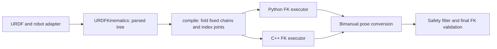

# Model preparation and real-time execution

The main refactoring boundary is the lifetime of the work: parse and prepare
geometry once, then execute a numerical plan for each command. Robot adapters
describe joint names and landmarks; numerical backends consume indexed arrays.



| Responsibility                                                        | Implementation                            |
| --------------------------------------------------------------------- | ----------------------------------------- |
| URDF parsing, topology and joint/link names                           | `robots/urdf.py`                          |
| Fixed-chain folding and joint/output indexing                         | `URDFKinematics.compile()`                |
| Immutable prepared model, ordered input contract and Python execution | `robots/kinematics.py`                    |
| Native binding boundary                                               | `CppKinematicsBackend` in `backends.py`   |
| Native FK computation and per-call scratch                            | `src/cpp/kinematics.h`                    |
| Shared native vector/rotation primitives                              | `src/cpp/math_utils.h`                    |
| Robot landmarks and tool-frame alignment                              | `robots/pose.py`                          |
| Collision projection, IK recovery and command validation              | `safety.py` and `robots/safety_filter.py` |

Both FK executors consume the same prepared topology, origins, axes and output
offsets. A fixed joint, or a movable joint omitted from the command vector, is
folded into its descendants at its zero configuration. Active joints are
addressed by their position in the supplied joint-name tuple. Selected links
retain caller order, including duplicate targets and the root link.

This keeps robot-specific naming and URDF interpretation in one place. The
native executor owns its numerical model and releases the GIL while evaluating
it. Both implementations allocate scratch per call, so a prepared model can
serve independent worker threads without sharing trajectory state.

```python
import numpy as np

from sew_mimic.robots import URDFKinematics, load_marvin_arm

arm = load_marvin_arm(side="left")
tree = URDFKinematics("assets/Marvin_M6_S_CCS_696_V4.0/robot_with_ee.urdf")
fk = tree.compile(arm.joint_names, (arm.ee_link,), backend="cpp")
tool_transform = fk.evaluate(np.zeros(7))[0]
```

`CompiledKinematics.evaluate()` accepts a finite one-dimensional vector in
`joint_names` order and returns owned `(N, 4, 4)` transforms in `link_names`
order. Preparation takes an independent geometry snapshot. Compile again after
changing URDF calibration; updates to an old result cannot change the model.

`MarvinSafetyFilter` and `OpenArmSafetyFilter` prepare their landmark FK once
and use their selected backend for FK, solving and collision work. Existing
constructors and return types remain compatible. `URDFKinematics.link_transforms()`
and `urdf_bimanual_pose()` retain direct parsed-tree evaluation for one-shot
queries. Repeated bimanual calls can use `URDFBimanualPoseEvaluator` explicitly.

The collision kernel also separates projection data from presentation data:
XPBD consumes centerline distance, normal and segment parameters; the public
`capsule_contact()` API constructs surface contact points when requested.
Scalar segment clamps use scalar arithmetic instead of repeated NumPy dispatch.

Validation compares prepared FK against direct tree traversal for randomized
Marvin/OpenArm configurations and a mixed revolute/prismatic/fixed tree. It
also covers output ordering, omitted joints, empty outputs, geometry ownership,
invalid commands, independent workers and full Python/C++ safety trajectories.

Native headers are included in source distributions and extension dependencies;
CI checks their formatting along with the binding translation unit.

## Device input boundary

The independent `tracking` package converts external device snapshots into the
existing `BimanualPose` contract. It owns coordinate decoding, timestamp/quality
checks, explicit calibration and bounded input delivery. SDK acquisition,
transport and operator engagement remain outside the numerical core.
`RobotSafetyFilter.retarget()` bridges a calibrated pose to both SEW solves
and the existing collision filter. See the [VR integration guide](vr-integration.md)
for the data contract, device capabilities and control lifecycle.

`tracking/recording.py` serializes canonical input events at this boundary.
Frames, calibration changes and control ticks retain their original order and
clock domain, so offline replay exercises the same freshness/filter/solver
path, including periods without packets. The reader streams bounded JSONL
records and verifies schema and completion; device SDKs and raw clock mapping
remain outside this format. The example uses one event consumer for both
synthetic acquisition and recording replay, without accumulating frame history.

`tracking/calibration.py` prepares world and hand/tool transforms offline from
paired reference observations. It separates fitting and residual-based acceptance
from the immutable `TrackingCalibration` used during execution. Applying a fit
uses the existing calibration event and reset path; numerical calibration work
and its geometry checks do not enter the per-frame retargeting loop.

`tracking/stream.py` owns the shared input lifecycle instead of leaving it in
an example control loop. `TrackingPoseStream` combines the latest-frame buffer,
accepted-fault notification, calibration changes and pose-filter history.
Discarding a payload does not discard its packet/time/reference ordering.
Transient faults survive replacement of the latest snapshot; loss/recalibration
recovery requires a newer sample before smoothing restarts. Duplicate control
ticks validate the input without transforming or filtering the same pose again.
Internal input state is serialized across publication and polling; robot solving,
engagement and actuator output remain application responsibilities.

`tracking/motion.py` supplies optional, immutable input motion limits. The
stream checks every valid raw snapshot before smoothing, retains the last
accepted motion reference across faults, and only clears it on explicit
calibration selection. The reference expires after a bounded sample gap;
rejected spikes cannot silently become the baseline for subsequent frames.
These relative input checks do not impose robot joint command limits.

`tracking/config.py` prepares an immutable snapshot of the input policy, filter
parameters and motion checks. `TrackingPoseStream.from_config()` creates fresh
runtime state from it, and the existing constructor exposes the same snapshot
through `stream.config`. Strict, bounded JSON parsing and metadata compatibility
run during setup, outside the per-frame path. The recorder preserves complete
settings as string metadata; the CLI and offline consumer restore the same
snapshot for replay instead of rebuilding input settings from scattered defaults.
