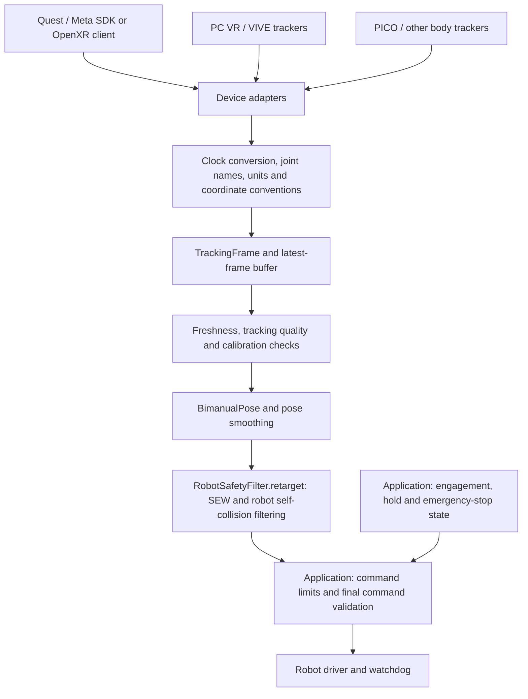

# VR and other tracking devices

Keep device acquisition outside the numerical solver. A device adapter produces
timestamped anatomical joints; calibration converts them into the shared robot
frame. The same retargeting and collision pipeline then serves Quest, PC VR,
PICO, motion-capture systems, and recorded inputs.



The SDK client, clock synchronizer, transport, calibration fitting, engagement
controller, and robot driver are application responsibilities. This repository
now implements the common snapshot/decoder/buffer/calibration boundary and its
connection to SEW. No physical headset or robot was used to validate this change.

## Select a mode from available tracking data

| Input capability                                          | Suitable route                                                          | Additional requirement                          |
| --------------------------------------------------------- | ----------------------------------------------------------------------- | ----------------------------------------------- |
| Both shoulders, elbows and wrists, plus hand orientations | Existing SEW body retargeting                                           | Joint semantics, quality checks and calibration |
| Headset and two controllers                               | Separate end-effector IK mode, or an explicit body estimator before SEW | Shoulder/elbow information is underdetermined   |
| Hand skeletons only                                       | Hand/gripper input plus another source for the arms                     | Finger/wrist joints do not supply upper arms    |
| Torso/arm trackers plus controllers                       | Attachment calibration and skeletal reconstruction, then SEW            | Synchronized clocks and consistent body roles   |

Meta's `XR_FB_body_tracking` exposes an estimated body skeleton. Availability
must be queried at runtime and requires the relevant permissions; inferred
body joints should not be described as independent physical measurements.
See [Meta body tracking](https://developers.meta.com/horizon/documentation/native/android/move-body-tracking/).
The default `FB_BODY_JOINT_MAP` maps upper-arm origin to shoulder, lower-arm
origin to elbow, and hand wrist to wrist. Validate these landmarks against the
runtime skeleton during integration; the named shoulder/clavicle joint is a
different landmark. See the [joint enumeration](https://registry.khronos.org/OpenXR/specs/1.1/man/html/XrBodyJointFB.html).

Standard OpenXR [hand joints](https://registry.khronos.org/OpenXR/specs/1.1/man/html/XrHandJointEXT.html)
cover the palm, wrist and fingers, so hand tracking alone cannot fill both SEW
chains. VIVE provides [tracker-specific extensions](https://hub.vive.com/apidoc/api/VIVE.OpenXR.Tracker.html);
PICO documents its own [body-tracking integration](https://developer.picoxr.com/document/unity/body-tracking/).
Use capability negotiation rather than assuming a brand, operating system,
or OpenXR support implies a particular body-tracking feature.

For a first implementation, build one Quest client exporting body snapshots
and a receiver using the common types. Add each subsequent device as an adapter
to the same contract. Keep a controller-only end-effector mode separate: the
current SEW objective matches limb directions and tool orientation, and does
not minimize absolute hand-position error. Robot physical joint offsets also
need not coincide with its SEW alignment axes.

## Implemented Python boundary

| API                                            | Responsibility                                                                                                 |
| ---------------------------------------------- | -------------------------------------------------------------------------------------------------------------- |
| `TrackingIdentity`                             | Source, connection session, reference space and space revision                                                 |
| `JointSample`                                  | Optional position/orientation and separate runtime tracking flags                                              |
| `TrackingFrame`                                | Owned, read-only joint data, sequence, synchronized pose time, local receive time and optional body confidence |
| `OpenXRAdapter`                                | Named-joint mapping, flag-aware decoding, units, quaternion order and coordinate basis conversion              |
| `LatestFrameBuffer`                            | One selected source/session; newest accepted snapshot, without an accumulating queue                           |
| `FramePolicy`                                  | Sample age, receive age, explicit prediction allowance and optional body-confidence threshold                  |
| `TrackingCalibration`                          | Reference identity check, world transform, per-hand tool-frame alignment and complete SEW input checks         |
| `RobotSafetyFilter.retarget`                   | World-to-arm conversion, both SEW solves and existing robot collision filtering                                |
| `TrackingRecorder` / `TrackingRecordingReader` | Streaming canonical JSONL recording and offline replay                                                         |
| `TrackingTick`                                 | Recorded control-loop time, including ticks without new tracking data                                          |
| `TrackingPoseStream`                           | Shared input ordering, fault notification, calibration lifecycle and pose smoothing                            |

These APIs live in `sew_mimic.tracking`, with only NumPy and standard-library
dependencies. Provider classes can return `TrackingFrame` directly; they do
not need to inherit an SDK-specific base class or modify robot adapters.

An SDK bridge can decode one captured body snapshot as follows:

```python
from sew_mimic.tracking import OpenXRAdapter, OpenXRJoint, TrackingIdentity

adapter = OpenXRAdapter()  # XR_FB body joint names, raw OpenXR coordinates, metres
identity = TrackingIdentity("quest-operator", "new-connection-id", "local", 0)

# captured_joints is supplied by your native/Unity bridge, keyed by SDK enum name.
samples = {
    name: OpenXRJoint(joint.position, joint.orientation_xyzw, joint.location_flags)
    for name, joint in captured_joints.items()
}
frame = adapter.decode(
    samples,
    identity=identity,
    sequence=sequence,
    sample_time=pose_time_in_receiver_monotonic_seconds,
    received_time=local_receive_time,
    active=body_is_active,
    confidence=body_confidence,  # None when the provider does not report it
)
```

Components without OpenXR `VALID` bits are never read: they may contain
undefined SDK values. Valid and `TRACKED` are distinct states, as described by
[OpenXR location flags](https://registry.khronos.org/OpenXR/specs/1.0/man/html/XrSpaceLocationFlagBits.html).
Missing data becomes `None`, never a zero position or identity rotation.
Body confidence stays body-level; adapters must not fabricate per-joint scores.

`TrackingCalibration.to_pose()` requires all six arm positions and both wrist
orientations. It accepts valid inferred data by default. Applications can set
`require_tracked=True` and/or `FramePolicy(min_confidence=...)`; an unknown
confidence fails a configured threshold. Runtime tracking bits alone do not
certify that a body joint was measured directly.

## Coordinate and tool calibration

Canonical tracking coordinates use metres and a right-handed basis with +X
forward, +Y left, +Z up. Raw OpenXR uses +X right, +Y up and -Z forward; see its
[view-space convention](https://registry.khronos.org/OpenXR/specs/1.1/man/html/XR_REFERENCE_SPACE_TYPE_VIEW.html).
Use a stable local/stage tracking reference rather than the moving head view
as the world reference. For a basis matrix `B` and unit scale `s`:

```text
p_canonical = s B p_source
R_canonical = B R_source Bᵀ

p_robot = R_robot_tracking p_canonical + t_robot_tracking
R_robot_tool = R_robot_tracking R_canonical_hand R_hand_tool
```

Basis conversion and physical calibration are different operations. The
adapter converts both world and local joint conventions. The calibration's
proper rotation acts on the left; the hand-to-tool offset acts on the right.
`UNITY_TO_FLU` is available for Unity Transform data that has already undergone
the SDK's coordinate conversion. It includes a reflection, so transforming
orientation with only `B R` would be incorrect. Declare the export convention
explicitly and avoid applying the raw OpenXR conversion twice.

At calibration time, choose a neutral torso pose, establish vertical and
forward directions, fit the tracking-to-robot transform, then fit left/right
hand-to-tool rotations separately. Verify the result with asymmetric poses
and rotations around all three axes. Do not infer torso heading solely from
where the operator looks. The offline fitting helpers below estimate these
values from paired observations and report residuals before application.

### Fit a rigid reference and both hand offsets

`fit_rigid_transform(tracking_points, robot_points)` fits a proper rotation and
translation to corresponding physical landmarks. It uses the SVD solution to
the rotation-constrained least-squares problem, described in this
[NIST treatment of Kabsch–Umeyama alignment](https://www.nist.gov/publications/purely-algebraic-justification-kabsch-umeyama-algorithm).
Scale stays fixed at one; a reflection is never applied as the calibration.

Use at least three noncollinear physical reference points observed in both
frames. Planar references are supported. The default `min_spread=0.001` requires
at least 1 mm RMS extent along each cloud's second principal axis; increase
this according to measurement noise and reference layout. Degenerate or
numerically ambiguous observations raise `CalibrationFitError`.

These are reference correspondences, not human-versus-robot skeleton pairs:
different limb lengths cannot be explained by one rigid transform. Establish
units and coordinate conventions before fitting. If using a controller as a
probe, account for its measured origin-to-tip offset before pairing touched
landmarks. Gather additional references throughout the intended working volume
and check independent observations after fitting.

`fit_hand_tool_rotation()` then fits each local hand-to-tool offset while the
world rotation is held fixed. Paired observations must satisfy the convention
`R_robot_tool = R_robot_tracking @ R_tracking_hand @ R_hand_tool` and correspond
to the same time. Supply robot orientations in the solver's aligned tool frame,
such as `safety.forward_kinematics(q_left, q_right).left.tool_orientation`.
One complete orientation pair determines an offset for a known world rotation;
multiple poses around different axes reveal noise and inconsistent alignment.
This helper does not jointly solve for two unknown world/tool transforms.

```python
import numpy as np

from sew_mimic.tracking import (
    TrackingCalibration,
    fit_hand_tool_rotation,
    fit_rigid_transform,
)

world = fit_rigid_transform(tracking_reference_points, robot_reference_points)
left = fit_hand_tool_rotation(
    left_tracking_hand_rotations,
    left_robot_tool_rotations,
    tracking_to_robot_rotation=world.rotation,
)
right = fit_hand_tool_rotation(
    right_tracking_hand_rotations,
    right_robot_tool_rotations,
    tracking_to_robot_rotation=world.rotation,
)

# Illustrative limits; choose them from the application's measurement budget.
world.require_accuracy(max_rms_error=0.002, max_point_error=0.005)
left.require_accuracy(max_rms_angle=np.deg2rad(1), max_angle=np.deg2rad(2))
right.require_accuracy(max_rms_angle=np.deg2rad(1), max_angle=np.deg2rad(2))

calibration = TrackingCalibration(
    identity,
    rotation=world.rotation,
    translation=world.translation,
    left_hand_to_tool=left.rotation,
    right_hand_to_tool=right.rotation,
)
```

World-fit `residuals`, `rms_error` and `max_error` use metres. Hand-fit
`angular_residuals`, `rms_angle` and `max_angle` use radians. Hand fitting
minimizes squared matrix error; diagnostics report rotation-angle error.
Results own read-only arrays. No sample is silently dropped, so outliers and
unit mismatches remain visible in residuals. `require_accuracy()` is an explicit
acceptance check; fitting alone does not update a running calibration or
authorize robot motion. Small fit residuals alone do not certify the result
outside the observed reference volume or reveal a constant measurement bias.

Write an accepted `TrackingCalibration` through `TrackingRecorder` when it
takes effect. The existing recording format already preserves its transforms
and identity; no format migration is needed. Reset input filters and require
fresh observations after applying it. Keep source/session/space-revision
changes tied to the same calibration lifecycle as manually supplied values.

Run the synthetic fitting example, which adds known position/orientation noise:

```bash
python -m examples.demo_tracking_calibration
```

Tests also convert the full synthetic motion into a different tracking frame,
fit its world and left/right tool offsets, and replay it through both robots
and both numerical backends. Reconstructed target poses and final joint outputs
are compared to the original motion with numerical tolerances.

`tool_length` supplies a virtual marker along the aligned tool's +X direction
for the pose interface. Robot collision geometry always comes from robot FK
and its configured capsules. Human limb lengths do not set robot link lengths.

Reconnection changes `session_id`. Recenter or reference-space replacement
increments `space_revision`, invalidating old calibration. OpenXR reports
reference-space changes with an effective time; apply the revision at that
boundary, as specified by
[reference-space change events](https://registry.khronos.org/OpenXR/specs/1.1/man/html/XrEventDataReferenceSpaceChangePending.html).
This implementation requires new calibration rather than automatically
composing a recenter delta. Reset smoothing after calibration changes.

## Timing, transport and loss handling

OpenXR [`XrTime`](https://registry.khronos.org/OpenXR/specs/1.0/man/html/XrTime.html)
has a runtime-selected epoch. It must be converted to a suitable system clock
and, for a remote headset, synchronized with the receiver. Dividing raw
nanoseconds by a billion does not make it comparable with Python's
`time.monotonic()`. The SDK/transport layer owns this conversion and must
monitor synchronization uncertainty and drift.

`sample_time` is the located pose's time in receiver monotonic seconds;
`received_time` is stamped by the receiver. Both ages are checked. Recently
received old measurements still expire. Predicted poses need an explicit
`max_prediction` allowance, chosen together with the clock error budget.
The default 100 ms age limits are configurable starting values, not a measured
latency budget or a hardware safety specification.

For a versioned wire protocol, include protocol version, source/session IDs,
sequence, reference-space revision, coordinate convention/units, raw runtime
pose time, tracking flags and joint payload. Exchange capabilities and
calibration metadata during connection setup. Stamp receive time locally and
derive the mapped timestamp through the synchronizer. Keep engagement and
emergency-stop control distinct from optional pose fields.

Transport can initially be a local SDK callback or a simple receiver on a
trusted test network. Choose the production transport after measuring device
constraints and latency; keep transport framing, authentication, clock sync
and reconnect logic outside the solver. Log raw input plus clock/calibration
metadata so a replay source can exercise the same decoding path.

`LatestFrameBuffer` accepts increasing sequences and nondecreasing space revisions
for the explicitly selected session. Active poses in the same space also need
nondecreasing sample times. New loss/recenter events invalidate older data even
when the provider attaches a cached, earlier pose timestamp; the previous maximum
pose time is retained to reject older poses on recovery. Old-session packets
cannot select another source or restore old calibration. `clear()` discards
the payload while preserving sequence, sample-time and reference-space ordering;
use it for recalibration within a connection. Recreate the buffer explicitly
on reconnect/source selection.

Pass the same `FramePolicy` to a standalone buffer when enabling prediction.
The buffer only advances its sample-time maximum when that timestamp passes
the policy at receipt. Packet/reference ordering and invalid status are still
retained. `TrackingPoseStream` also discards a clock-invalid payload, preserves
the fault notification and waits for input newer than its last valid timestamp
boundary. A single erroneous future sample therefore cannot block normal clock
recovery or become usable merely by waiting for time to catch up. This assumes
`received_time` is stamped in the receiver's correct monotonic clock domain.

Check freshness and tracking status on every control tick, including ticks
with no new packet. Update the pose filter only when a valid sample timestamp
strictly increases. Repeated timestamps may carry loss/recenter information,
so inspect status before skipping duplicate pose samples. A decoder failure
must notify the application's hold state; silently discarding malformed
packets while continuing to use the last good target is insufficient.

For multiple devices, add a dedicated fusion stage before the complete
`TrackingFrame`: synchronize times, calibrate attachment offsets, preserve
provenance and explicitly select the source for each joint. Do not concatenate
the newest independently timed hand and elbow observations into one pose.

## VR pose filtering

The shared stream filters calibrated input before SEW solving. Position and
rotation need independent tuning because their noise and speed units differ.

| Signal                              | Processing                                                                    | Units used by adaptation   |
| ----------------------------------- | ----------------------------------------------------------------------------- | -------------------------- |
| Shoulder, elbow and wrist positions | Component-wise One Euro adaptive low-pass filter                              | metres and metres/second   |
| Left/right tool orientations        | One Euro angular-speed adaptation with shortest-arc quaternion SLERP          | radians and radians/second |
| Virtual tool markers                | Reconstructed as filtered wrist + tool length × filtered orientation's X axis | metres                     |

Rotation interpolation preserves SO(3) and follows the short arc across a
half-turn. Tool markers stay consistent with the filtered wrist orientation
and configured length. Filtering each marker independently could shrink the
offset and disagree with the angular output during a turn. The generic
`BimanualPoseFilter` retains independent eight-keypoint filtering for FK poses
unless `tool_length` is supplied.

`min_cutoff`, `beta` and `derivative_cutoff` configure position smoothing.
Pass an immutable `OneEuroConfig` as `rotation_config` to tune angular smoothing
independently; when omitted, rotations use the existing shared parameters.
Cutoffs are in Hz. Position beta scales component speed in m/s; rotation beta
scales angular speed in rad/s. Apply unit conversion before filtering.

For tuning, start with beta at zero and adjust the minimum cutoff while holding
still and moving slowly. Lower cutoff reduces jitter and increases lag. Then
increase beta while testing fast motion to reduce lag. Tune each signal on
recorded input; numerical settings do not transfer unchanged between units.
This procedure follows the [filter author's tuning guidance](https://github.com/casiez/OneEuroFilterArduino#tuning-the-parameters).
Our implementation uses an exact exponential first-order gain; evaluate its
response directly when transferring settings from another implementation.

```bash
python -m examples.demo_tracking_filtering --rate 90
```

The example compares raw, fixed-cutoff and adaptive output with a fixed seed,
3 mm / 0.8 degree simulated noise and irregular sample intervals. It reports
stationary RMS after warmup and, separately, the time to reach 90% of a noiseless
0.2 m / 30 degree step. These filter response times exclude headset, transport
and robot latency. Its profiles illustrate the tradeoff; they are not measured
Meta or other device presets. Rates of 72, 90 and 120 Hz are supported.

`TrackingStreamConfig` captures the chosen filter parameters, input policy and
motion limits in a versioned snapshot. The CLI saves and restores that snapshot
with recording metadata; live applications can use `stream.config.to_metadata()`.
Changing tuning intentionally changes the resulting command sequence.

Filter using mapped `sample_time`, never packet arrival or control-loop time.
The stream does not refilter duplicate samples or extrapolate through loss.
Freshness, identity and joint validity are checked first. Arithmetic overflow
rejects the complete update before any of the three filter histories advance;
the stream requests a hold and resets them together. Smoothing does not infer
missing joints or fuse asynchronous devices, and does not impose robot joint
velocity limits. Preserve the downstream retargeting and command checks.

## Rejecting motion spikes before smoothing

Adaptive smoothing increases its response to fast changes, including erroneous
spikes. `TrackingMotionLimits` adds an optional plausibility check in `publish()`
after identity, freshness and joint validity checks, before any filter update.
It compares canonical raw snapshots, so smoother lag and the control tick rate
do not relax the check. Every accepted packet is inspected, including those
replaced before the next control tick.

```python
from sew_mimic.tracking import TrackingMotionLimits, TrackingPoseStream

# Illustrative values only: choose these from the intended motion and device noise.
limits = TrackingMotionLimits(
    max_joint_speed=2.0,           # m/s, Euclidean speed of each of six SEW joints
    max_wrist_angular_speed=6.0,   # rad/s, shortest rotation angle per sample interval
    max_sample_gap=0.1,           # maximum interval from the last valid reference
)
poses = TrackingPoseStream(calibration, motion_limits=limits)
```

Either speed limit can be omitted; at least one must be configured. Passing
`motion_limits=None` preserves the existing behaviour without speed checks.
An enabled component must not move at a repeated sample timestamp. The angular
check follows the short arc across a half-turn and retains small-angle resolution.
An outlier creates a pending `TrackingUnavailable` notification and resets
smoothing, while keeping the previous valid snapshot as the motion reference.
A good newer frame within `max_sample_gap` can recover with cold filter history.

Loss, decoder errors, timeouts and rejected motion do not clear that reference.
Once its sample interval exceeds `max_sample_gap`, the stream keeps holding even
if the pose returns near the old position. This prevents a growing elapsed time
from eventually admitting a persistent large offset. After application review,
`poses.set_calibration(calibration)` explicitly clears the reference and requires
a newer sample to establish another one. The same calibration can be reapplied;
re-estimating its transform is only needed if it has changed. Repeated timestamps
after this reset cannot seed the new reference.

The first valid sample establishes the comparison baseline; these relative
limits do not validate its absolute position. They also do not detect every
possible drift or bound robot joint motion. Choose speed limits and the gap
together using expected sample intervals, tracking noise and intended motion.
Keep hardware engagement and command validation in the application controller.

When testing recorded data, store `json.dumps(dataclasses.asdict(limits))` under
the `motion_limits` metadata key and restore it with
`TrackingMotionLimits(**json.loads(metadata["motion_limits"]))`. The JSON string
preserves the version-1 recording contract, whose metadata values are strings.
The string `"null"` explicitly records disabled limits.
The offline `run_tracking_events(..., motion_limits=limits)` helper applies the
same policy to synthetic and recorded frames. The CLI also records and restores
these settings automatically:

```bash
python -m examples.demo_tracking_input --robot marvin --max-joint-speed 2 \
  --max-wrist-angular-speed 6 --max-motion-gap 0.25 --record /tmp/tracking-limits.jsonl
python -m examples.demo_tracking_input --replay /tmp/tracking-limits.jsonl
```

CLI limit flags explicitly override their recorded fields; `--no-motion-limits`
disables the checks for comparison. The effective limits are printed with the
run result. Such overrides can change the command digest. Old recordings with
no motion-limit metadata keep the existing default without speed checks.

## Reproducible input configuration

`TrackingStreamConfig` groups freshness/prediction/confidence policy, position
filter parameters, optional independent rotation parameters, motion limits and
the tracked-joint requirement. Create each stream from the same immutable
snapshot to give live processing and replay identical input settings:

```python
from pathlib import Path

from sew_mimic import OneEuroConfig
from sew_mimic.tracking import FramePolicy, TrackingPoseStream, TrackingStreamConfig

config = TrackingStreamConfig(
    policy=FramePolicy(max_sample_age=0.1, max_receive_age=0.1),
    position_filter=OneEuroConfig(min_cutoff=1.0, beta=0.02),
    rotation_filter=OneEuroConfig(min_cutoff=1.5, beta=0.02),
    require_tracked=False,
)
poses = TrackingPoseStream.from_config(calibration, config)
recording_metadata = {"robot": "marvin", **poses.config.to_metadata()}
Path("/tmp/tracking-config.json").write_text(config.to_json(), encoding="utf-8")
```

The existing `TrackingPoseStream(...)` constructor also exposes its effective
settings through `stream.config`. Frame-policy inputs are normalized to owned
scalar values, so changing a caller's NumPy parameter array cannot alter an
active configuration. Every stream owns fresh buffer and filter histories.
Calibration changes continue through the existing ordered calibration events.

```bash
python -m examples.demo_tracking_input --config /tmp/tracking-config.json \
  --record /tmp/tracking-configured.jsonl
python -m examples.demo_tracking_input --replay /tmp/tracking-configured.jsonl
```

`--config` explicitly replaces the full recorded configuration. Individual
motion-limit flags apply afterwards and preserve the other settings;
`--no-motion-limits` only disables motion checks. The CLI prints the complete
effective snapshot. Offline Python callers can use
`run_tracking_events(..., config=config)`; supply motion limits inside that
configuration when using this form.

`to_json()` writes all fields, including optional nulls, in a deterministic
format. `from_json()` accepts configuration version 1, bounded to 4096
characters, and rejects missing/unknown fields, duplicate keys, unsupported
versions and invalid scalar values. `rotation_filter=None` explicitly retains
the shared position/rotation parameter behaviour.

`to_metadata()` stores the snapshot as the `tracking_config` JSON string and
mirrors its motion limits in the earlier `motion_limits` metadata field.
`from_metadata()` checks that both entries agree. This preserves the existing
string-valued JSONL metadata contract. It also reads older motion-only metadata
and files with no settings. Unrecorded custom filter parameters in an old file
must be supplied through `--config` to reproduce that session.

Replay calibration, frame and control-tick events in their original order with
a fresh stream. Compare digests using the same backend and software version.
The nondefault-configuration tests reproduce both successful solves and holds
from input expiry or joint-limit rejection across Marvin/OpenArm and both
numerical backends.

## Shared input lifecycle

`TrackingPoseStream` owns the input-side lifecycle used by the demo and can also
serve a live adapter. The latest pose remains bounded to one snapshot; fault
notifications are retained separately so an accepted invalid frame cannot be
hidden by a later good frame arriving before the next control tick.

| Method                         | Behaviour                                                                                                                     |
| ------------------------------ | ----------------------------------------------------------------------------------------------------------------------------- |
| `publish(frame)`               | Accept ordered input from the selected source/session; latch accepted tracking faults and reference changes                   |
| `poll(now=...)`                | Check current input every tick and return a newly filtered `BimanualPose`; return `None` for an unchanged, still-valid sample |
| `invalidate(reason)`           | Report a decoder or application failure, clear smoothing history and require newer input                                      |
| `set_calibration(calibration)` | Apply an explicitly chosen calibration, discard the cached pose and reset smoothing; preserve ordering within a connection    |

```python
from sew_mimic import OneEuroConfig
from sew_mimic.tracking import FramePolicy, TrackingPoseStream, TrackingUnavailable

poses = TrackingPoseStream(
    calibration,
    policy=FramePolicy(max_sample_age=0.1, max_receive_age=0.1),
    min_cutoff=1.0,
    beta=0.02,
    rotation_config=OneEuroConfig(min_cutoff=1.5, beta=0.02),
)

# Acquisition callback, after decoding and clock conversion:
accepted = poses.publish(frame)

# Control callback, including ticks with no new packets:
try:
    target = poses.poll(now=receiver_monotonic_time)
except TrackingUnavailable as exc:
    enter_application_hold_state(str(exc))
else:
    if target is not None:
        process_new_target(target)  # Application-owned solving and command checks.
```

`publish()` returning `True` means the packet was accepted into the ordered
stream, not that its pose is usable. Identity, quality and SEW completeness
are checked on publication; freshness is evaluated relative to its receiver
timestamp. Polling checks again at the actual control time. A transient fault
is reported through `TrackingUnavailable` at least once, even when a valid
recovery frame is already available. A reference change raises the more
specific `CalibrationRequired` until a current calibration is explicitly
applied. Applying an older or conflicting reference revision is rejected.

After loss, timeout, invalidation or recalibration, a newly numbered packet
containing the same old sensor timestamp cannot restart smoothing. A strictly
newer sample is required. A new source/session explicitly selected through
`set_calibration()` starts new packet/sample ordering; the receiver's control
clock must still be monotonic. `poll()` rejects nonfinite or decreasing control
times. Do not reset ordering merely to make delayed or duplicate packets pass.

When the pose is unchanged, `poll()` performs validity/freshness checks without
repeating coordinate transforms or advancing smoothing. `TrackingCalibration.check_frame()`
also exposes this allocation-light validation independently. Both SEW segments
must have finite, nonzero lengths; missing positions/orientations and calibrated
transform overflow produce an unavailable target.

Call `invalidate()` if decoding fails before a `TrackingFrame` can be produced,
or if downstream retargeting rejects a target. Otherwise, resetting smoothing
alone can cause the same rejected input to be retried as if it were new.
Explicit invalidation is an application signal; the version-1 canonical log
does not encode this call separately. Record external fault context alongside
raw acquisition/application logs when that context is needed for replay.

Methods serialize their internal state, allowing a producer thread and one
control consumer. The lock does not cover subsequent robot solving, command
output or application engagement state. Fault notification requests a hold;
the stream does not command a physical stop or automatically authorize recovery.
Keep engagement and command hand-off coordinated in the application controller.

## Robot control boundary

The application should own an explicit state machine:

```mermaid
stateDiagram-v2
    [*] --> Disconnected
    Disconnected --> Calibrating: Connect with new session
    Calibrating --> Ready: Calibration and input checks pass
    Ready --> Engaged: Explicit operator engagement
    Engaged --> Hold: Release, stale input, tracking loss or rejected command
    Hold --> Ready: Input and robot state recovered; filters reset
    Ready --> Calibrating: Reference space changes
    Engaged --> Calibrating: Reference space changes; hold robot
    Hold --> Calibrating: Reference space changes
```



Any state must also handle disconnect and emergency stop. This diagram is an
application design, not an implemented robot controller. Tracking readiness
alone never authorizes motion. On hold/recovery, reset smoothing and command
limiter state using fresh robot feedback and require re-engagement.

Pass a calibrated, filtered `BimanualPose` and measured current joint vectors
to `safety.retarget(pose, q_left_current, q_right_current)`. Initial IK errors
propagate to the caller; collision filtering returns a structured result.
After command limiting, validate the actual command that will be sent.
The existing capsule filter checks configured self-collision geometry and
does not certify the swept joint-space motion, environment clearance, or
physical robot safety. A hardware driver needs its own watchdog and stop path.

## Canonical recording and deterministic replay

`tracking/recording.py` records input after SDK decoding and clock conversion.
The JSONL stream contains a versioned header, ordered events, and a completion
marker with an event count. Version 1 uses metres, 3-by-3 orientation matrices,
and the receiver's monotonic clock domain. It preserves identities, space
revisions, missing joint components, tracking flags and optional confidence.

Three event types make input-side behaviour reproducible:

| Event                 | What is preserved                                                                                          |
| --------------------- | ---------------------------------------------------------------------------------------------------------- |
| `TrackingFrame`       | Canonical joints and original sample/receive timestamps, including inactive, repeated and reordered frames |
| `TrackingCalibration` | The reference identity, world transform and both hand-to-tool offsets                                      |
| `TrackingTick`        | When the controller checks the latest input, even when no packet arrives                                   |

Record incoming frames before the latest-frame buffer rejects or overwrites
them, record calibration changes when they take effect, and record each control
tick. Preserve the order in which these events reach the consumer. Logging
only accepted poses loses information about dropouts, rejected packets and
the control-loop schedule.

```python
from sew_mimic.tracking import TrackingRecorder, TrackingRecordingReader

with open("tracking.jsonl", "x", encoding="utf-8") as stream:
    with TrackingRecorder(stream, metadata={"robot": "marvin"}) as recorder:
        recorder.write(calibration)
        for event in ordered_input_and_control_events:
            recorder.write(event)  # TrackingFrame, TrackingCalibration or TrackingTick

with open("tracking.jsonl", encoding="utf-8") as stream:
    reader = TrackingRecordingReader(stream)
    for event in reader:
        offline_consumer(event)
```

The recorder owns neither the file nor the application's threading policy.
Use one recording worker for file I/O; keep disk writes out of the control
loop. An application queue must preserve event order and report overflow
rather than silently dropping events from a supposedly complete recording.
Successful recorder context exit appends the completion marker and flushes;
an exception leaves the recording incomplete. File durability across power
loss is not guaranteed by flushing alone.

The reader processes one bounded record at a time (at most 1 MiB of characters
by default). Unknown versions/conventions, duplicate JSON keys, missing or
extra fields, nonfinite numbers, invalid geometry and decreasing control ticks
are rejected with a line number. Truncated logs and wrong completion counts
are errors. Consume the iterator fully to verify completion; after a parsing
or I/O failure it cannot silently resume at another record.

During offline replay, `TrackingTick.timestamp` supplies the logical control
clock. Both frame timestamps remain unchanged, so a delayed measurement still
expires and an interval without packets still triggers timeout checks. Do not
substitute today's clock or refresh recorded receive times. Replaying faster
than real time changes execution speed, not the recorded age checks.

This is an offline canonical-input format, not a live network protocol. Live
receivers must stamp receipt locally and synchronize device clocks themselves.
To debug SDK decoding or clock synchronization, additionally capture raw SDK
samples and clock-mapping observations. Reproducing physical robot commands
also requires measured robot feedback, model/configuration versions and the
application's engagement state; these are not inferred from a tracking log.

## Run the hardware-free example

```bash
python -m examples.demo_tracking_input --robot marvin
python -m examples.demo_tracking_input --robot openarm --backend cpp
python -m examples.demo_tracking_input --robot marvin --record /tmp/tracking-demo.jsonl
python -m examples.demo_tracking_input --replay /tmp/tracking-demo.jsonl
pytest -q tests/unit/test_tracking*.py tests/integration/test_tracking*.py
```

The example synthesizes human-length SEW chains, smooths and retargets a small
motion, and injects one inactive frame and nine control ticks without incoming
frames. The default 60-tick run produces 50 solved targets, five holds (one
tracking loss and four timeouts), and five unchanged commands while the previous
sample is still fresh. Simulation resumes on valid input; no driver is connected.

`--record` creates a new file and refuses to overwrite an existing one.
`--replay` takes the robot from recording metadata, or requires `--robot` if it
is absent. Both modes use `run_tracking_events()` with `TrackingPoseStream`
and print a `command_digest`
covering every control time and resulting joint command. With the same backend,
model, configuration and numerical environment, recording and replay should
produce the same digest. Bitwise equality across backends/platforms is not
required. The demo uses the robot's neutral profile as its starting state and
the previous simulated command as feedback.

Tests cover OpenXR decoding, handedness, tracking quality, clock/freshness
checks, calibration invalidation, malformed/incomplete recordings, bounded
stream reads and replay parity for both robots and Python/C++ backends.
Regression cases additionally cover loss/recovery between control ticks,
duplicate packets after recalibration, cold filter recovery and rejected IK
targets that must wait for newer tracking input before another solve.

The next device-specific deliverable is a real SDK exporter and synchronized
receiver feeding the canonical recorder, followed by a calibrated preview.
Physical robot engagement should follow validation of the actual command path.
